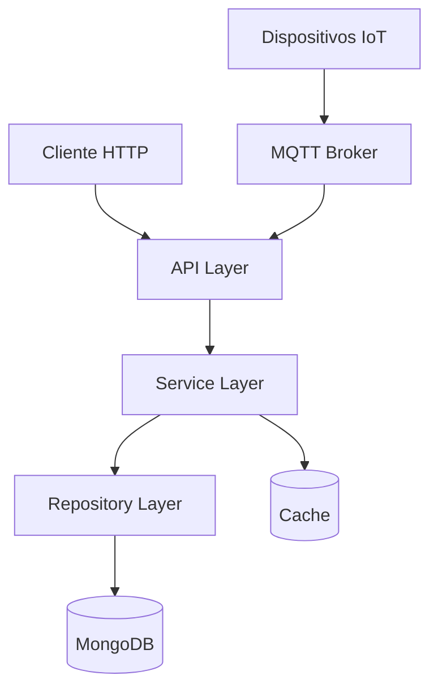
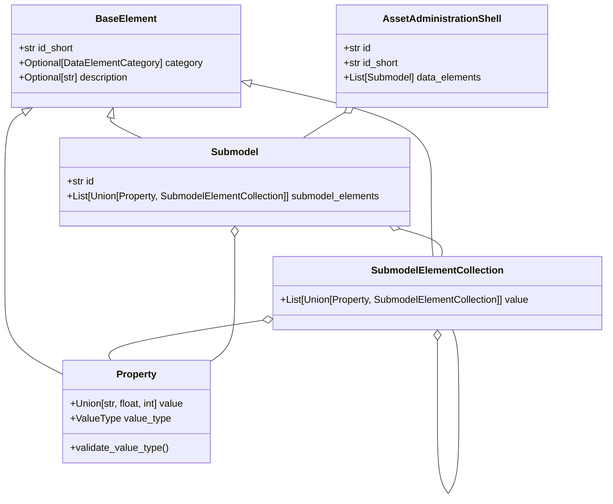
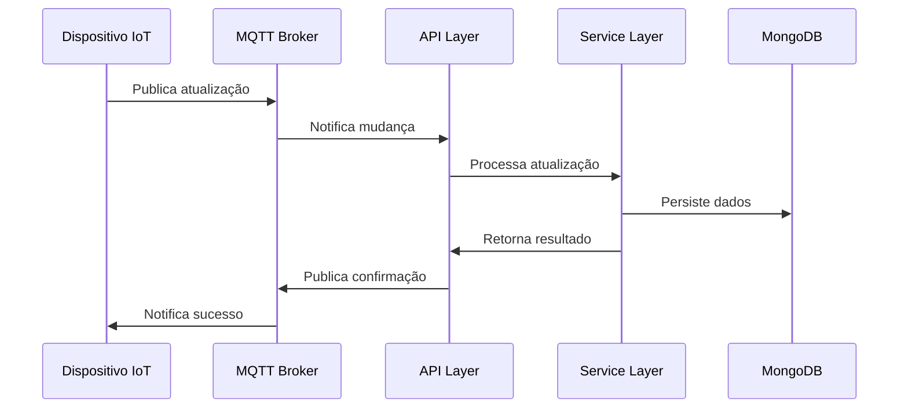
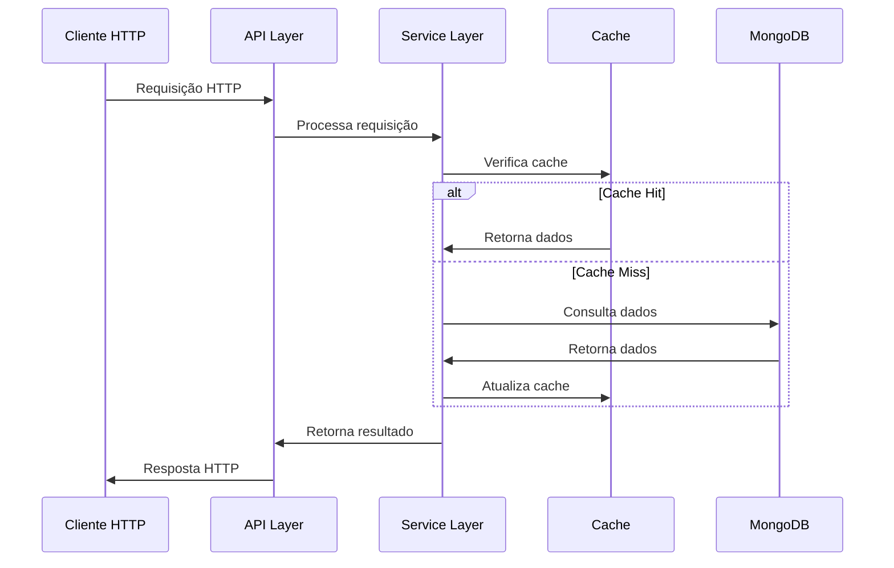
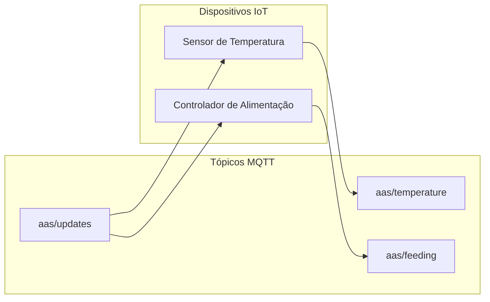
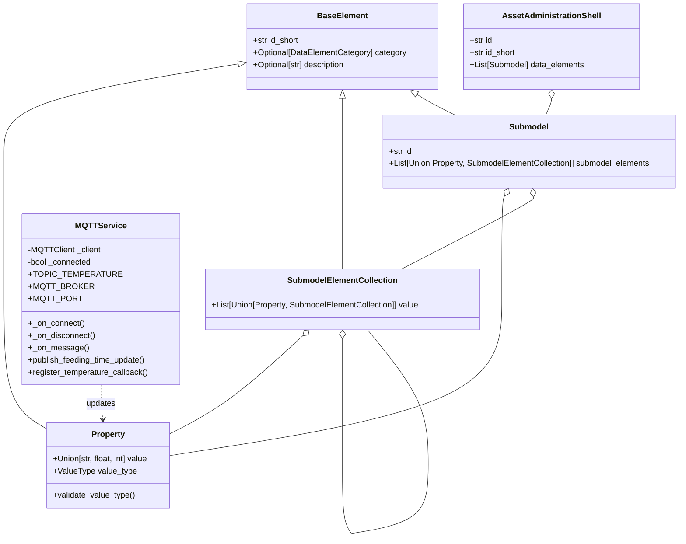

# Asset Administration Shell API

Um backend usado para servir e historizar metamodelos de AAS seguindo a estrutura utilizada por arquivos .aasx encontrada em [Metamodel v3](https://industrialdigitaltwin.org/wp-content/uploads/2024/06/IDTA-01001-3-0-1_SpecificationAssetAdministrationShell_Part1_Metamodel.pdf).

## 🏗️ Arquitetura do Sistema

### Visão Geral

O sistema é construído seguindo uma arquitetura em camadas, com separação clara de responsabilidades e comunicação assíncrona via MQTT para atualizações em tempo real.



### Componentes Principais

#### 1. API Layer (`src/api/`)
- **Routes**: Endpoints HTTP REST
  - `aas.py`: Rotas para gerenciamento do AAS
  - `temperatures.py`: Rotas para histórico de temperaturas
- **Services**: Lógica de negócio
  - `aas_service.py`: Serviços para manipulação do AAS
  - `mqtt_service.py`: Gerenciamento de comunicação MQTT
- **Models**: Schemas Pydantic
  - `aas.py`: Modelos de dados do AAS
  - `temperature.py`: Modelos para dados de temperatura

#### 2. Service Layer (`src/services/`)
- **AASService**: Gerenciamento do Asset Administration Shell
  - Criação e atualização de submodelos
  - Manipulação de propriedades
  - Validação de dados
- **MQTTService**: Comunicação em tempo real
  - Publicação de atualizações
  - Subscrição a tópicos
  - Callbacks para eventos

#### 3. Repository Layer (`src/repositories/`)
- **MongoDBRepository**: Persistência de dados
  - Armazenamento do AAS
  - Histórico de temperaturas
  - Cache de propriedades

#### 4. Models (`src/models/`)


### Fluxo de Dados

1. **Atualização de Propriedades**


2. **Consulta de Dados**


### Comunicação MQTT

O sistema utiliza MQTT para comunicação em tempo real com dispositivos IoT:



### Estratégia de Cache

O sistema implementa uma estratégia de cache em múltiplas camadas:

1. **Cache de Propriedades**
   - Armazena valores recentes
   - TTL configurável
   - Invalidação automática

2. **Cache de Submodelos**
   - Estrutura completa
   - Atualização incremental
   - Persistência em memória

3. **Cache de Histórico**
   - Dados temporais
   - Agregação por período
   - Limpeza automática

### Segurança

- Autenticação via JWT
- Validação de tipos com Pydantic
- Sanitização de inputs
- Rate limiting
- CORS configurável

### Monitoramento

- Logs estruturados
- Métricas de performance
- Health checks
- Alertas automáticos

## Diagrama de Classes



## Funcionalidades

### AAS (Asset Administration Shell)
- Gerenciamento completo do AAS
- Suporte a submodelos e coleções
- Propriedades variáveis e constantes
- Validação de tipos de dados
- Persistência em MongoDB

### Monitoramento de Temperatura
- Coleta de dados de temperatura via MQTT
- Histórico de temperaturas
- Armazenamento em tempo real
- API para consulta de histórico

### Sistema de Alimentação
- Gerenciamento de horários de alimentação
- Atualização em tempo real via MQTT
- Configuração flexível de horários
- Integração com dispositivos IoT

## Tecnologias Utilizadas

- FastAPI
- MongoDB
- MQTT (gmqtt)
- Pydantic
- Python 3.12+

## Configuração

1. Clone o repositório
2. Crie um ambiente virtual:
```bash
python -m venv venv
source venv/bin/activate  # Linux/Mac
# ou
venv\Scripts\activate  # Windows
```

3. Instale as dependências:
```bash
pip install -r requirements.txt
```

4. Configure as variáveis de ambiente:
```bash
MONGODB_URL=mongodb://localhost:27017
DATABASE_NAME=aas_db
```

5. Inicie o servidor:
```bash
uvicorn src.api.main:app --reload
```

## Documentação da API

A documentação interativa está disponível em:
- Swagger UI: `http://localhost:8000/docs`
- ReDoc: `http://localhost:8000/redoc`

## Estrutura do Projeto

```
aas-API/
├── src/
│   ├── api/
│   │   ├── routes/
│   │   ├── services/
│   │   ├── models/
│   │   └── main.py
│   ├── models/
│   └── utils/
├── requirements.txt
└── README.md
```

## Contribuição

1. Faça um fork do projeto
2. Crie uma branch para sua feature (`git checkout -b feature/AmazingFeature`)
3. Commit suas mudanças (`git commit -m 'Add some AmazingFeature'`)
4. Push para a branch (`git push origin feature/AmazingFeature`)
5. Abra um Pull Request

# AAS API

API para gerenciamento de Asset Administration Shell (AAS) com suporte a MQTT para atualizações em tempo real.

## 🚀 Instalação

```bash
# Clone o repositório
git clone https://github.com/DevMiguelPinheiro/aas-API.git

# Entre no diretório
cd aas-API

# Instale as dependências
pip install -r requirements.txt
```

## ⚙️ Configuração

1. Configure as variáveis de ambiente no arquivo `.env`:
```env
MQTT_BROKER=localhost
MQTT_PORT=1883
MQTT_TOPIC=aas/updates
```

2. Inicie o servidor:
```bash
uvicorn src.api.main:app --reload
```

## 📚 Documentação da API

### AAS Endpoints

#### 1. Obter AAS Completo
```http
GET /aas
```

**Resposta:**
```json
{
    "id": "AAS_1",
    "id_short": "AAS_1",
    "semantic_id": "https://example.com/aas",
    "kind": "Instance",
    "data_elements": [
        {
            "id": "Temperatura_1",
            "id_short": "Temperatura",
            "semantic_id": "https://example.com/temperatura",
            "kind": "Instance",
            "submodel_elements": [
                {
                    "id_short": "CurrentTemperature",
                    "value": "25.5",
                    "value_type": "float"
                },
                {
                    "id_short": "TemperatureHistory",
                    "value": [
                        {
                            "id_short": "Timestamp",
                            "value": "2024-02-20T10:00:00",
                            "value_type": "string"
                        },
                        {
                            "id_short": "Value",
                            "value": "25.5",
                            "value_type": "float"
                        }
                    ]
                }
            ]
        }
    ]
}
```

#### 2. Criar/Atualizar AAS
```http
POST /aas
```

**Requisição:**
```json
{
    "id": "AAS_1",
    "id_short": "AAS_1",
    "semantic_id": "https://example.com/aas",
    "kind": "Instance",
    "data_elements": [
        {
            "id": "Temperatura_1",
            "id_short": "Temperatura",
            "semantic_id": "https://example.com/temperatura",
            "kind": "Instance",
            "submodel_elements": [
                {
                    "id_short": "CurrentTemperature",
                    "value": "25.5",
                    "value_type": "float"
                }
            ]
        }
    ]
}
```

### Propriedades Endpoints

#### 1. Obter Propriedades Variáveis
```http
GET /aas/properties/variable
```

**Resposta:**
```json
[
    {
        "id_short": "CurrentTemperature",
        "value": "25.5",
        "value_type": "float"
    }
]
```

#### 2. Obter Propriedades Constantes
```http
GET /aas/properties/constant
```

**Resposta:**
```json
[
    {
        "id_short": "MaxTemperature",
        "value": "100.0",
        "value_type": "float"
    }
]
```

#### 3. Atualizar Propriedade
```http
PUT /aas/properties/{property_id_short}
```

**Requisição:**
```json
{
    "value": "26.5"
}
```

**Resposta:**
```json
{
    "id_short": "CurrentTemperature",
    "value": "26.5",
    "value_type": "float"
}
```

### Submodelos Endpoints

#### 1. Obter Submodelo por ID
```http
GET /aas/submodels/{submodel_id_short}
```

**Resposta:**
```json
{
    "id": "Temperatura_1",
    "id_short": "Temperatura",
    "semantic_id": "https://example.com/temperatura",
    "kind": "Instance",
    "submodel_elements": [
        {
            "id_short": "CurrentTemperature",
            "value": "25.5",
            "value_type": "float"
        },
        {
            "id_short": "TemperatureHistory",
            "value": [
                {
                    "id_short": "Timestamp",
                    "value": "2024-02-20T10:00:00",
                    "value_type": "string"
                },
                {
                    "id_short": "Value",
                    "value": "25.5",
                    "value_type": "float"
                }
            ]
        }
    ]
}
```

### Temperatura Endpoints

#### 1. Obter Histórico de Temperaturas
```http
GET /temperatures
```

**Resposta:**
```json
[
    {
        "timestamp": "2024-02-20T10:00:00",
        "value": 25.5
    },
    {
        "timestamp": "2024-02-20T10:01:00",
        "value": 25.7
    }
]
```

### Debug Endpoints

#### 1. Visualizar Estrutura do AAS
```http
GET /aas/debug/structure
```

**Resposta:**
```json
{
    "message": "Estrutura do AAS impressa no console"
}
```

#### 2. Visualizar Estrutura Detalhada do AAS
```http
GET /aas/debug/detailed
```

**Resposta:**
```json
{
    "message": "Estrutura detalhada do AAS impressa no console"
}
```

## 🔄 MQTT

A API utiliza MQTT para publicar atualizações em tempo real. As mensagens são publicadas no tópico configurado (padrão: `aas/updates`) no seguinte formato:

```json
{
    "property_id_short": "CurrentTemperature",
    "value": "25.5",
    "timestamp": "2024-02-20T10:00:00"
}
```

## 📝 Notas

- Todas as rotas retornam respostas em formato JSON
- Valores de propriedades podem ser strings, números ou booleanos
- Timestamps são formatados em ISO 8601
- A API inclui validação de tipos e valores
- Todas as rotas são documentadas no Swagger UI (`/docs`)
