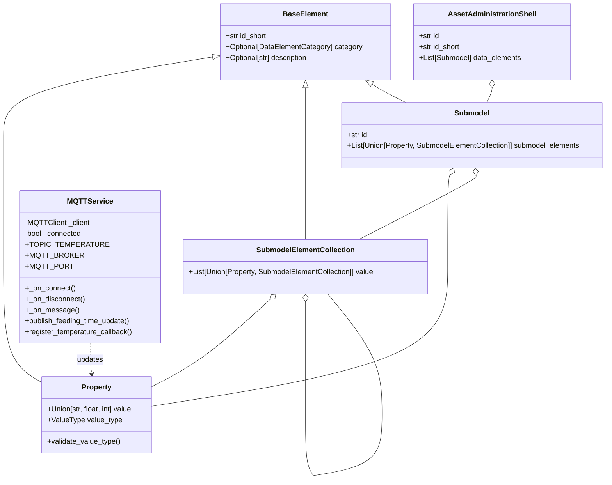

# Asset Administration Shell API

Um backend usado para servir e historizar metamodelos de AAS seguindo a estrutura utilizada por arquivos .aasx encontrada em [Metamodel v3](https://industrialdigitaltwin.org/wp-content/uploads/2024/06/IDTA-01001-3-0-1_SpecificationAssetAdministrationShell_Part1_Metamodel.pdf).

## Diagrama de Classes



## Funcionalidades

### AAS (Asset Administration Shell)
- Gerenciamento completo do AAS
- Suporte a submodelos e coleções
- Propriedades variáveis e constantes
- Validação de tipos de dados
- Persistência em MongoDB

### Monitoramento de Temperatura
- Coleta de dados de temperatura via MQTT
- Histórico de temperaturas
- Armazenamento em tempo real
- API para consulta de histórico

### Sistema de Alimentação
- Gerenciamento de horários de alimentação
- Atualização em tempo real via MQTT
- Configuração flexível de horários
- Integração com dispositivos IoT

## Tecnologias Utilizadas

- FastAPI
- MongoDB
- MQTT (gmqtt)
- Pydantic
- Python 3.12+

## Configuração

1. Clone o repositório
2. Crie um ambiente virtual:
```bash
python -m venv venv
source venv/bin/activate  # Linux/Mac
# ou
venv\Scripts\activate  # Windows
```

3. Instale as dependências:
```bash
pip install -r requirements.txt
```

4. Configure as variáveis de ambiente:
```bash
MONGODB_URL=mongodb://localhost:27017
DATABASE_NAME=aas_db
```

5. Inicie o servidor:
```bash
uvicorn src.api.main:app --reload
```

## Documentação da API

A documentação interativa está disponível em:
- Swagger UI: `http://localhost:8000/docs`
- ReDoc: `http://localhost:8000/redoc`

## Estrutura do Projeto

```
aas-API/
├── src/
│   ├── api/
│   │   ├── routes/
│   │   ├── services/
│   │   ├── models/
│   │   └── main.py
│   ├── models/
│   └── utils/
├── requirements.txt
└── README.md
```

## Contribuição

1. Faça um fork do projeto
2. Crie uma branch para sua feature (`git checkout -b feature/AmazingFeature`)
3. Commit suas mudanças (`git commit -m 'Add some AmazingFeature'`)
4. Push para a branch (`git push origin feature/AmazingFeature`)
5. Abra um Pull Request
