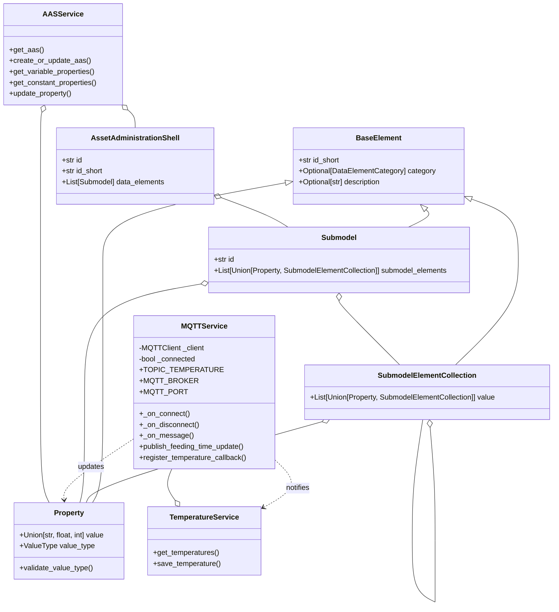

# AAS API

API RESTful construída com FastAPI e MongoDB para gerenciamento de Asset Administration Shell (AAS) e monitoramento de temperatura.

## Diagrama de Classes



## Pré-requisitos

- Python 3.12+
- MongoDB
- Broker MQTT (opcional, para funcionalidades de tempo real)

## Configuração

1. Crie um ambiente virtual e ative-o:
```bash
python -m venv venv
source venv/bin/activate  # Linux/Mac
# ou
venv\Scripts\activate  # Windows
```

2. Instale as dependências:
```bash
pip install -r requirements.txt
```

3. Configure as variáveis de ambiente em um arquivo `.env`:
```env
MONGODB_URL=mongodb://localhost:27017
DATABASE_NAME=aas_db
```

## Executando a Aplicação

Inicie o servidor com:
```bash
uvicorn src.api.main:app --reload
```

A API estará disponível em `http://localhost:8000`

## Documentação da API

- Swagger UI: `http://localhost:8000/docs`
- ReDoc: `http://localhost:8000/redoc`

## Endpoints Disponíveis

### AAS (Asset Administration Shell)

#### Gerenciamento do AAS
- `GET /aas` - Retorna o AAS completo
- `POST /aas` - Cria ou atualiza o AAS

#### Propriedades
- `GET /aas/properties/variable` - Lista todas as propriedades variáveis
- `GET /aas/properties/constant` - Lista todas as propriedades constantes
- `PUT /aas/properties/{property_id_short}` - Atualiza uma propriedade específica

### Monitoramento de Temperatura

- `GET /temperatures` - Retorna o histórico de temperaturas
  - Parâmetros de consulta:
    - `limit`: Número máximo de registros (padrão: 100)
    - `start_date`: Data inicial (formato: YYYY-MM-DD)
    - `end_date`: Data final (formato: YYYY-MM-DD)

## Estrutura de Dados

### AAS
```json
{
    "id": "string",
    "id_short": "string",
    "data_elements": [
        {
            "id": "string",
            "id_short": "string",
            "submodel_elements": [
                {
                    "id_short": "string",
                    "value": "string|number",
                    "value_type": "string|float|int",
                    "category": "CONSTANT|PARAMETER|VARIABLE"
                }
            ]
        }
    ]
}
```

### Temperatura
```json
{
    "temperature": 25.5,
    "timestamp": "2024-02-20T10:30:00"
}
```

## Integração MQTT

A API se integra com um broker MQTT para:
- Receber dados de temperatura em tempo real
- Publicar atualizações de horários de alimentação

### Tópicos MQTT
- `iTamba/temperature` - Recebe dados de temperatura
- `FishTankAAS/FishFeeding/{property_id}` - Publica atualizações de horários

## Logs

A API utiliza um sistema de logging abrangente que registra:
- Conexões MQTT
- Recebimento de mensagens
- Atualizações de propriedades
- Erros e exceções

## Middleware

- CORS habilitado para todas as origens
- Logging middleware para rastreamento de requisições
- Tratamento de erros global 